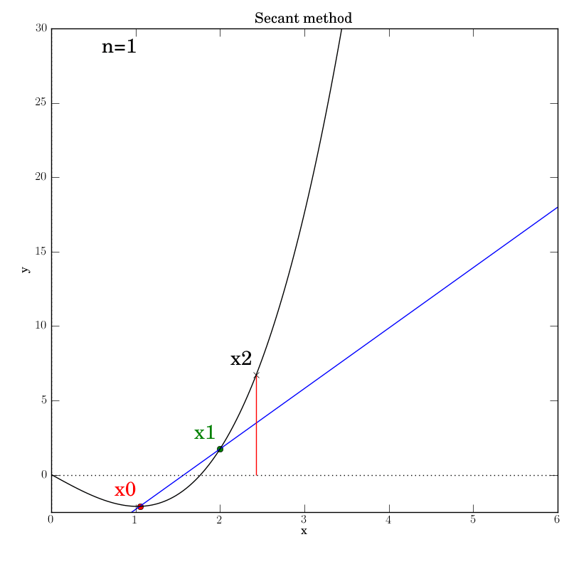
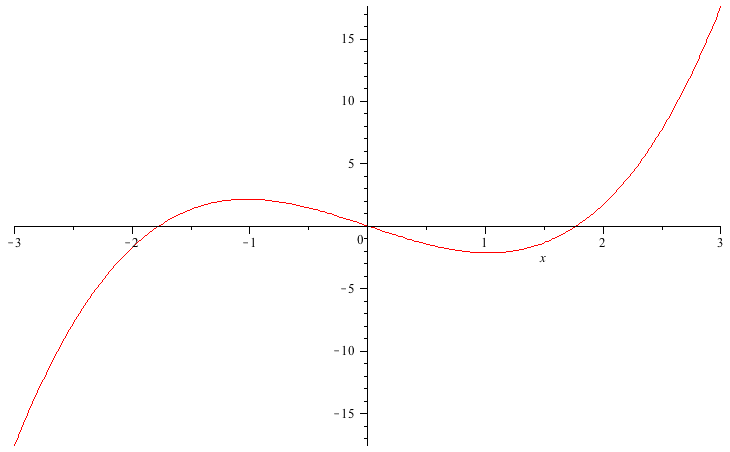
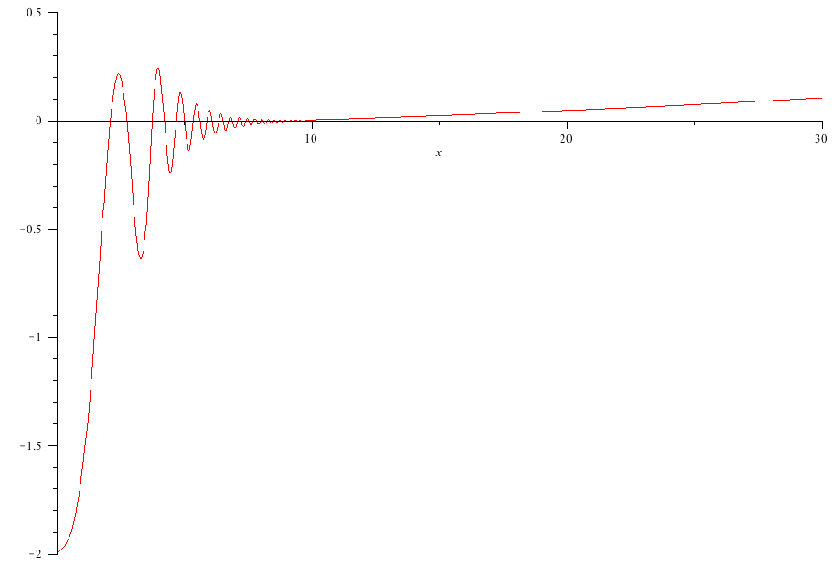
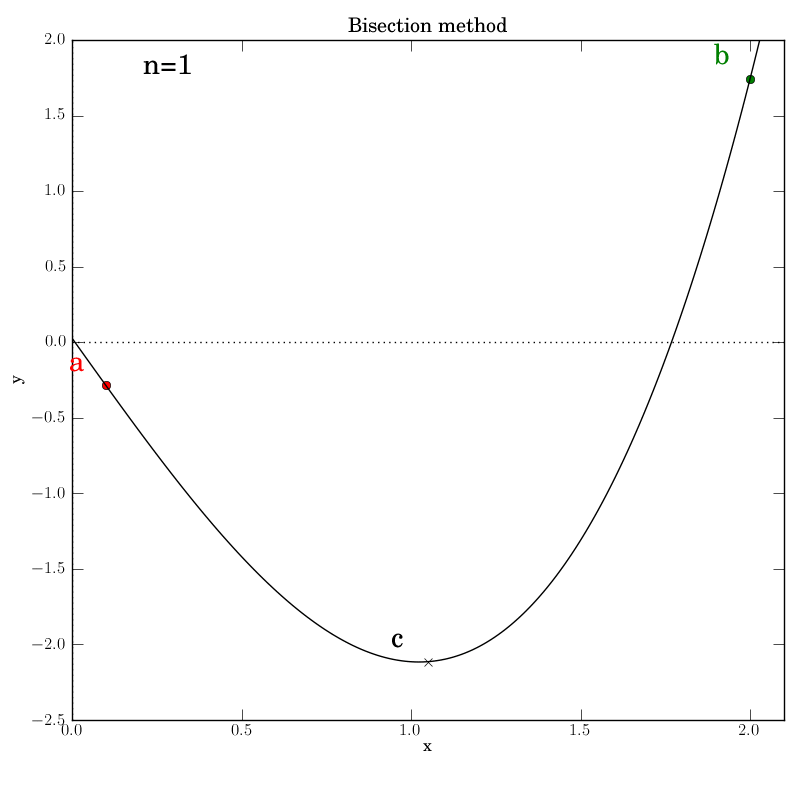
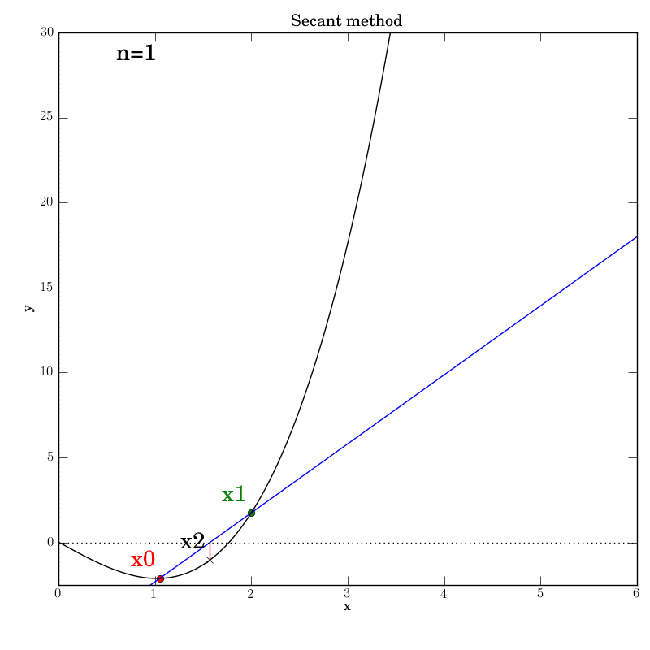
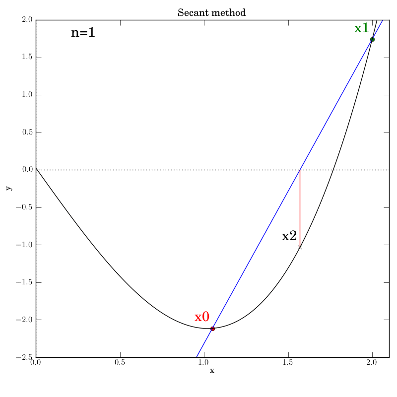
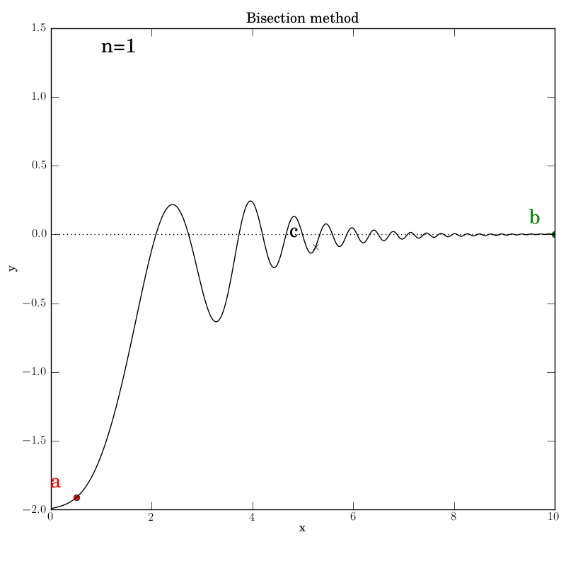
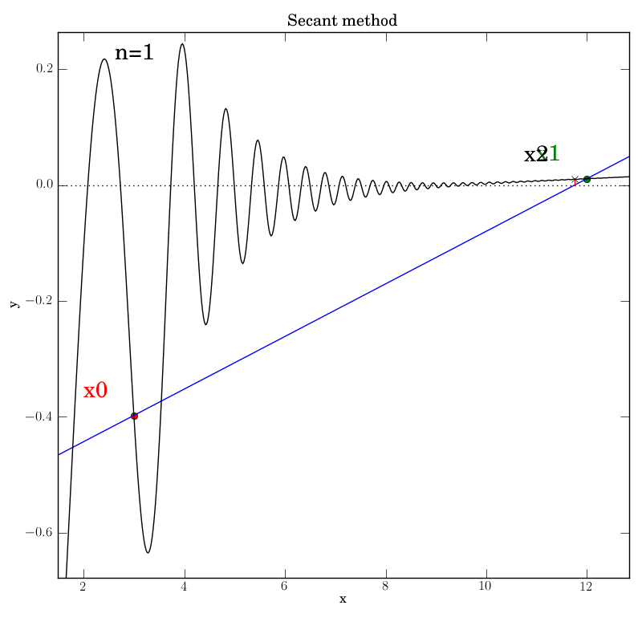
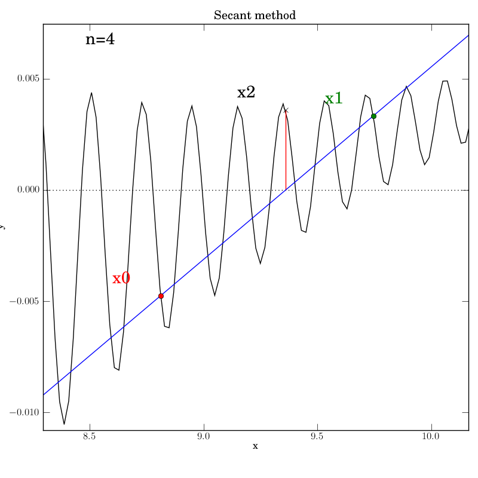
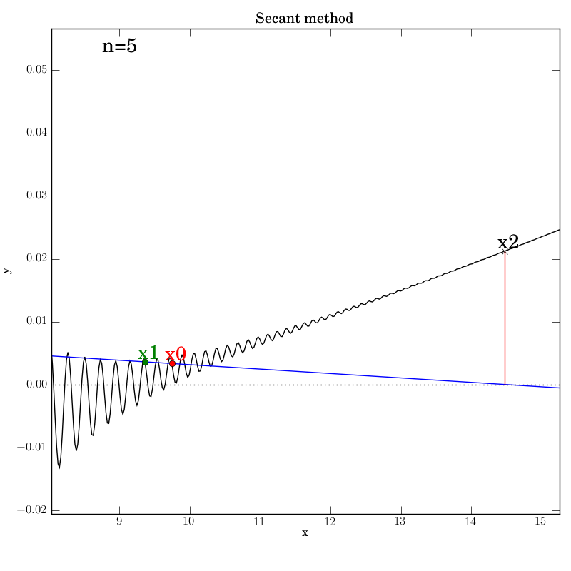



**Table of Contents**

- [The need for better diagnostics with complex algorithms](#head1)
	- The worst offender is the hidden assumptions
	- Towards test-driven analysis
- [Pre-requisites for this demo](#head2)
	- Code dependencies
	- Knowledge dependencies
	- Other assumptions
- [Demonstration examples](#head3)
	- Function 1
	- Function 2
	- Bisection with a well behaved function
		- Attempt 1: Success
		- A look through the test script
	- Secant method with a well behaved function
		- Attempt 1: First bug
		- Attempt 2: Second bug
		- Attempt 2: Third bug
		- Attempt 3: Success
	- Bisection with a poorly behaved function
	- Secant method with a poorly behaved function
	- Viewing the logs
- [Discussion](#head4)
	- Overhead
	- Next steps
	- Not using ipython notebooks, again
- [Next installment with Fovea](#head5)

----------

In today's post we will give an overview of an early prototype of a
new diagnostic tool for numeric algorithms, known as
[Fovea](http://github.com/robclewley/fovea).
I began creating this tool a couple of years ago with one of my graduate
students, and I am continuing it now as part of my push for having
effective tools for my research. In fact, I'm fortunate to have a
[Google Summer of Code](http://www.google-melange.com/gsoc/project/details/google/gsoc2015/akuefler/5668600916475904)
student working with me on this project right now.

Fovea has a lot more to it, involving interactive graphical widgets
for many analytical functions, including controlling parameters or
position along trajectories while enjoying automatically-refreshing
sub-plots that reflect changes. Today, we are just looking at its
structured logging and basic plotting. This is not a full tutorial but
a demonstration of capability and a teaser for the thorough
documentation that will be forthcoming during the GSoC project.

As software developers and experimental scientists know, the first
thing you have to do at the beginning of a new project is to spend a
lot of time building (or buying) tools and instruments before you
can execute the project itself. With the kinds of
[exploratory computational science project](http://www.ni.gsu.edu/~rclewley/Research/index.html)
that I undertake, I always find myself short of good diagnostics to
guide my (or my students') progress towards a goal.

Because, as always, I will be introducing several new ideas here, we
will keep today's examples elementary. Next time we look at these
tools, we'll ramp up the complexity and apply them to a saddle
manifold computation that I've been working on, so you can see a more
realistic application that can really benefit from the tools. Today's
post is pedagogical: I'll present how to pick apart the workings of
common root-finding algorithms, and graphically track and log their
progress during their iterative steps. With the large overhead in
preparation and execution, I wouldn't expect anyone to want to set
this up for a mere root finding algorithm unless they were using it as
an educational tool for teaching numerical analysis.

Here's an easy-to-setup animation of some of the demo's raw output to
motivate you to read further...

We have enough new ideas to cover here that, for the time being, I
won't be presenting this work in the form of my [literate modeling
workflow](http://robclewley.github.io/capturing-the-provenance-of-model-prototyping-and-development/).

## The need for better diagnostics with complex algorithms

Let's say you write an algorithm, or you are asked to apply an
existing algorithm that has a lot of tricky parameters to set.

It is typical to try running it and hope that it "just works" right
out of the box, but that rarely happens, right? Common complaints will then
be: "Why is it not working properly?" or "How can I make it run
faster?" Until you understand what's happening under the hood, you
often don't stand a chance of optimizing the use of the algorithm.

If you even get this far beyond blind trial and error, the most common
way to track progress is with `print` statements. And that's already
an order of magnitude improvement. But for more sophisticated
algorithms or hairy problems, you can still get lost in reams of text
output. In some cases, especially those related to dynamical systems
modeling, graphing some of the data generated by the algorithm during
its operation can be more helpful. Again, that probably yields another
order of magnitude improvement on understanding.

### The worst offender is the hidden assumptions

When you're working on really hard problems involving strong
nonlinearities, multiple scales, poor conditioning, noisy data, etc.,
the algorithms you are interested in understanding can end up nested
inside other algorithms. A simple example is a
[predictor-corrector method](http://en.wikipedia.org/wiki/Predictor%E2%80%93corrector_method),
used for many things but commonly found in
[numerical continuation](http://en.wikipedia.org/wiki/Numerical_continuation)
algorithms. Correction is often done using
[Newton's Method](http://en.wikipedia.org/wiki/Newton%27s_method), but
Newton's Method is a slippery thing to handle. If you aren't confident
about certain properties of your starting situation, that
method can rapidly diverge.

This example is already non-trivial to understand if you are new to
high-level applied math, but it's just the beginning! As complex
projects involve more nested computations, the accumulating
assumptions that are necessary to ensure each computation will be
successful (or efficient) also compose together in a complex way. It
can become unfeasibly difficult to pre-validate or post-verify the
satisfaction of all the relevant assumptions, moreso than any other
challenge in executing the project.

This challenge is mainly due to the usually implicit nature of the
assumptions. For the sake of efficiency, many implementations do not
validate all their inputs and instead expect the caller (either the
end user or another algorithm) to *know what they are doing*. That
passing of the buck is fair but is extremely problematic once
algorithms become nested and if the user's experience or expert
knowledge of the algorithms is limited. Moreover, in many cases, it
can be either theoretically impossible or, at least, practically
difficult for algorithms to validate all the assumptions relevant to
their effectiveness *even if* that could be done quickly enough to
not degrade performance.

### Towards test-driven analysis

We could obviously add unit tests for the algorithm's code
implementation, but if we don't understand much about the possible
emergent properties of nested algorithms then it's hard to write
thorough and appropriate tests *a priori*. Even with some good tests
written, if they fail at runtime because of a logical or semantic
error then we might need to diagnose and explore the behavior of the
algorithm on a specific problem or class of problems before we can
write appropriate test. Fovea can play a role in this. The literate
modeling principles could also lead to a clearer understanding of the
convoluted assumptions when dealing with nested algorithms.

## Pre-requisites for this demo

### Code dependencies

Download [Fovea](http://github.com/robclewley/fovea/tree/blog_post)
from github and install with the usual `python setup.py install`. This
link is to a version tagged at the time of writing, to keep with the
functionality exactly as presented here. You can, of course, also get
the latest version and see what has progressed in the meantime.

**ADDENDUM 1: For Python 3.x users, I had to subsequently update the github repo, so checkout the latest one**

**ADDENDUM 2: For Windows users, you may need to install pyeuclid from my github fork (covers some Python 3 compatibility not present in PyPI) and the [geos](http://trac.osgeo.org/geos/) dependency for the python shapely package. Binaries are available by independently installing shapely from [here](http://www.lfd.uci.edu/~gohlke/pythonlibs/#shapely) or you can try to do it yourself using the appropriate version of [OSGeo4W](http://trac.osgeo.org/osgeo4w/).**

At present, the package depends on `shapely`, `descartes`, `pyyaml`,
`euclid`, [`PyDSTool`](http://github.com/robclewley/pydstool) (latest
github version at time of writing or the forthcoming v0.90.1 for those
of you in the future), `structlog`, and `tinydb`, although only the
last three are actually needed for this particular presentation. In
turn, `PyDSTool` requires `numpy`, `scipy`, and `matplotlib`,
which are essential for Fovea.

At the time of writing, one package dependency
([TinyDB](http://github.com/msiemens/tinydb)) is not correctly
automatically installing from this setup process on some platforms,
and you may need to first run `pip install tinydb` (or by inserting
the `--upgrade` option before `tinydb` if you already have pre-v.2)
before re-running my `setup.py` script.

### Knowledge dependencies

You can read an introduction to
[root finding on wikipedia](http://en.wikipedia.org/wiki/Root-finding_algorithm).
I'm not going to introduce it here except to say that it is ubiquitous
and highly relevant to science, engineering, or medical computation
wherever you need to detect zero crossings in images, signals, or
curves.

[Bisection](http://en.wikipedia.org/wiki/Bisection_method) is a
method that most computational scientists have seen or even used at
some point. (It is conceptually similar to the discrete version known
as "binary search".) It's comparably slow but reliable and
robust. Once at least one root is known to exist in an interval, the
method *will* converge. On the other hand, Newton-like methods are
very fast but rather fussy about what is known of the test function's
properties ahead of time.

The
[secant method](http://en.wikipedia.org/wiki/Secant_method) that we
use here is a Newton-like iterative method, which uses a simple finite
difference in lieu of the function's symbolic derivative (as this may
be unknown or hard to compute):

\( x_n = \left( x_{n-2} f(x_{n-2}) - x_{n-1} f(x_{n-1}) \right) / \left( f(x_{n-1}) - f(x_{n-2}) \right) \)

These two methods are sufficient to show off the principles of Fovea
for algorithm diagnostics.

### Other assumptions

Our major assumption is that we have access to the algorithm's source
code (i.e., a 'white box' situation) and knowledge of where
to put diagnostic elements. When developing open source algorithms,
this should not be a difficult assumption to satisfy.

--------

## Demonstration examples

I am using my fork of a
[Gist](http://gist.github.com/robclewley/ca3df340d39f6501f124), which
contains deliberate errors in the secant implementation for us to
diagnose and fix. I am basing the algorithm implementations on someone
else's original code to reinforce the idea that analysis can be set up
on existing functions *without changing their API* or, if so desired,
without affecting any of the function's existing output (e.g. `print`
statements, warnings, or errors). Once either the code is understood
or properly debugged and tested, all the diagnostic statements can
simply be stripped out without having to alter any of the original
statements. For instance, any meta data or intermediate data that
needs to be stored or logged does not have to be temporarily returned
by the function by altering its `return` statements or internal logic. The
logger takes care of capturing all that non-output related data for
later processing. This simplifies testing and avoids introducing more
bugs when trying to restore the function to its original state.

Now for the two test functions, whose roots we will seek.

### Function 1

\\[ f_1(x) = x^3- \pi/x + e/100 \\]

This is a simple cubic function with three roots slightly offset
from integer values:

### Function 2

\( f_2(x) = -1.13+\tanh(x-2)+4 \exp(-x) \sin((1/8) x^3) x+ \exp(x/35)/10 \).

From a numerical analysis standpoint, the second
function can be an unpleasant function for several reasons. Primarily,
it crosses the axis many times between *x* = 0 and 10. It is highly
non-monotone, nonlinear and exhibits multiple scales. Notice that its frequency
increases cubically as its amplitude decreases. The function is
completely contrived but was chosen to resemble the
[Gibbs' phenomenon](http://en.wikipedia.org/wiki/Gibbs_phenomenon)
in realistic signals and in Fourier analysis. It looks like this on
our domain of interest:

### Bisection with a well behaved function

We will run the test script `bisection_test1.py` in this
sub-section. The script calls on a modified version of `num` in `num_modded.py`.

For reference, the original bisection function is given in `num_original.py`
(taken directly from [here](http://gist.github.com/swvist/3775568)),
and looks like this:

~~~
def bisection(f, a, b, TOL=0.001, NMAX=100):
    """
    Takes a function f, start values [a,b], tolerance value(optional) TOL and
    max number of iterations(optional) NMAX and returns the root of the equation
    using the bisection method.
    """
    n=1
    while n<=NMAX:
        c = (a+b)/2.0
        print("a=%s\tb=%s\tc=%s\tf(c)=%s"%(a,b,c,f(c)))
        if f(c)==0 or (b-a)/2.0 < TOL:
            return c
        else:
            n = n+1
            if f(c)*f(a) > 0:
                a=c
            else:
                b=c
    return False
~~~

The original code came with no description of assumptions or tests to
verify the correctness of the code. It does include a `print`
statement to monitor the values of `a`, `b`, and `c` during iteration.

On quick inspection, we can realize that it has been assumed that *b*
\> *a* in the tolerance check before the first return statement. For
now, we will not worry about the lack of `abs()` or a check for this
ordering. Nor will we worry about the usual validation test that the
given interval [*a*, *b*] actually contains a sign change in the test
function *f*. It is reasonable to test these things before using the
function but at least the graphical diagnostics help us to see this
for ourselves in practice.

The bisection function is embellished with log statements for all the
major steps, replacing the `print` statement with ` dm.log.msg('Bisect
loop', a=a, b=b, c=c)`. This asks the logger make an entry for the
event named "Bisect loop" and record the current `float` values of
the variables by name.

Additionally, we invoke graphical output that shows the intermediate
data in each iteration step: the interval endpoints `a` and `b` (red
and green dots, resp.) and their point of bisection, `c`.

~~~
def bisection(f, a, b, TOL=0.001, NMAX=100):
    """
    Takes a function f, start values [a,b], tolerance value(optional) TOL and
    max number of iterations(optional) NMAX and returns the root of the equation
    using the bisection method.
    """
    n=1
    dm.log.msg('Call args', a=a, b=b, TOL=TOL, NMAX=NMAX)
    plotter.addText(0.1, 0.95, 'n=%d'%n, use_axis_coords=True,
                    name='n_value', layer='meta_data', style='k')
    while n<=NMAX:
        dm.log = dm.log.bind(n=n)
        plotter.setText('n_value', 'n=%d'%n, 'meta_data')
        if n == 1:
            rebuild = True
        else:
            plotter.toggleDisplay(layer='bisect_text_%d'%(n-1))
            plotter.toggleDisplay(layer='bisect_data_%d'%(n-1))
            rebuild = False
        plotter.addLayer('bisect_data_%d'%n)
        plotter.addLayer('bisect_text_%d'%n, kind='text')
        c = (a+b)/2.0
        dm.log.msg('Bisect loop', a=a, b=b, c=c)
        a_pt = plot_pt(a, f, n, 'a', 'r', 'bisect', 'o')
        b_pt = plot_pt(b, f, n, 'b', 'g', 'bisect', 'o')
        c_pt = plot_pt(c, f, n, 'c', 'k', 'bisect', 'x')

        if f(c)==0 or abs(b-a)/2.0 < TOL:
            dm.log.msg('Success', fval=f(c), err=(b-a)/2.0)
            dm.log = dm.log.unbind('n')
            plotter.show(rebuild=rebuild)
            return c
        else:
            n = n+1
            if f(c)*f(a) > 0:
                dm.log.msg('Same sign')
                a=c
            else:
                dm.log.msg('Opposite sign')
                b=c
            dm.log.msg('Step', err=(b-a)/2.0)
            plotter.show(rebuild=rebuild)
    dm.log.msg('Failure', status='fail', fval=f(c), err=(b-a)/2.0)
    dm.log = dm.log.unbind('n')
    return False
~~~

The plots make use of a helper function `plot_pt` that's set up to
save code repetition:

~~~
def plot_pt(x, f, n, name, col, layer_root, marker='o'):
    """
    Internal diagnostic helper function.
    """
    pt = pp.Point2D(x, f(x))
    plotter.addPoint(pt, style=col+marker, name=name+'_%d'%n,
                     layer=layer_root+'_data_%d'%n, log=dm.log)
    fs = plotter.figs['Master']
    ax = fs.arrange['11']['axes_obj']
    xlim = ax.get_xlim()
    ylim = ax.get_ylim()
    x_ext = xlim[1]-xlim[0]
    y_ext = ylim[1]-ylim[0]
    # add marker text at a distance proportional to size of
    # current axis extent
    plotter.addText(pt[0]-0.05*x_ext, pt[1]+0.02*y_ext, name,
                    use_axis_coords=False, name=name+'_%d'%n,
                    layer=layer_root+'_text_%d'%n, style=col)
    return pt
~~~

`dm` is the (shorthand) name for the global `diagnostic_manager`
object from `fovea/diagnostics.py`, and `plotter` is the name for the
global `plotter2D` object from `fovea/graphics.py`.

The `dm.log` object is a `structlog` object that performs structured
logging. Details of this package can be found in its
[online docs](http://www.structlog.org/en/stable/getting-started.html).
In particular, it is used here to bind the current value of `n` to the
logging statements during each iteration. This is known as making a
context. The log output lines automatically reflect this context. For
example, the log line

    n=6 status='ok' layer='bisect_data_6' name='a_6' figure='Master'
    event='Added plot data'

appears when code line 79 of `num_modded.py` is executed:

    a_pt = plot_pt(a, f, n, 'a', 'r', 'bisect', 'o')

We selected for the log to be dumped to a JSON file in a sub-directory
named after our diagnostic attempt. This directory will be created if
it doesn't already exist. The graphics will automatically be saved
there too in PNG format.

Calls to the plotter are automatically logged by passing the log
object as an optional argument to any plotter calls that add or change
data.

    plotter.addPoint(pt, style=col+marker, name=name+'_%d'%n,
                     layer=layer_root+'_data_%d'%n, log=dm.log)

The `plotter` object represents a system built over `matplotlib`. It
contains convenient structures for organizing plots of many
inter-related elements using a matplotlib-based, configurable GUI. For
instance, its core organization is based on figures, axes, **layers**,
and individual plotted object elements. Notice that it's the "layers"
that are the new feature here: the rest are just the regular
matplotlib elements but grouped together in a way that allows a GUI to
be built over specially designated windows. Layers are useful for
exactly the same reason they are useful in a package like Photoshop:
they provide a powerful organizational tool for related objects or
functions that can be grouped and treated as a single entity. Thus, it
is easy to switch the visibility of whole layers, or to delete all the
objects in a particular layer, or change all the line styles in a layer.

We will show layers to be helpful for managing and quickly
navigating lots of metadata that are produced during the execution of
a long iteration. At this time, there can be no nested sub-layers.

#### Attempt 1: Success

The various graphs output from our test script produced this GIF:

#### A look through the test script

~~~
# domain of interest
DOI = ([0,2.1],[-2.5,2])

plotter.clean() # in case rerun in same session
plotter.addFig('Master',
               title='Root Finding Diagnostic',
               xlabel='x', ylabel='y',
               domain=DOI)

dm.use_dir('bisect1_success')
dm.make_log('log.json')
plotter.dm = dm

# default to wait for user input on each iteration
plotter.wait_status = True
~~~

Near the beginning of the script, we declare two primary plotting
layers: 'fn\_data' and 'meta\_data'.

~~~
plotter.addLayer('fn_data')      # kind defaults to 'data'
plotter.addLayer('meta_data', kind='text')
~~~

We specify that the arrangement of the
figure will have: 

~~~
plotter.arrangeFig([1,1], {'11':
                           {'name': 'Bisection method',
                            'scale': DOI,
                            'layers': '*',  # all layers will be selected
                            'axes_vars': ['x', 'y']}
                           })

gui.buildPlotter2D((8,8), with_times=False)

# permanent axes
plotter.addHLine(0, style='k:', layer='fn_data')
plotter.addVLine(0, style='k:', layer='fn_data')
~~~

We will be making more layers for this figure within the call to the
`bisect` method, but we are able to specify *now* that *all* layers
will belong to this figure using the `'*'` wildcard option. In the
future, I could imagine making the syntax options more like what we
expect from text search using partial matches and both the `*` and `?`
wildcards to help structure the figures based on layer naming
conventions.

During each iteration, text that shows the iteration value of `n` is
updated on the figure in global, absolute axis coordinates. That way,
the text position remains the same regardless of how the axes are
zoomed or panned within the plot.

Each iteration involves making two new layers for each `n`, one for
the label text ('bisect\_text\_*n*') and one for the points
('bisect\_data\_*n*'). Into each one, we add the relevant data. After
that, we switch off the visibility of the previous *n*'s two
layers. Thus, the layer data is still searchable and accessible after
the calculation is over, and can be reviewed from interactive
commands. During this interaction over an iteration step, the
resulting figure updates from a call to `plotter.show()`.

We simply invoke the diagnostics using the same call that would be
done when using the function for real: `root = bisection(f1, 0.1, 2)`,
which will hopefully return the *x* value of a root in [0.1, 2].

At the end of each iteration, we have selected to pause and wait for
user confirmation to proceed. This allows the user to inspect the
graphical output, resize it, etc. Pressing "s" autosaves the state of
the main figure before proceeding. From the saved PNG files, I simply
ran them through an online GIF maker.

Presently, there is no way to auto-zoom to the same settings on each
iteration in order to ensure a smooth animation. I could have tried
harder to make the plots line up better between iterations, but I'm
sure you can get the idea.

### Secant method with a well behaved function

The secant function is embellished with logging for all major steps and
graphics that show intermediate data: the previous two `x` values (red and green dots),
the secant line that they imply (blue), and the new `f(x2)` value (marked by
a cross) that is projected out on a red line to the curve from the
point at which the secant line crosses the axis.

Although all the diagnostic functions add a lot of code to the script,
you'll quickly notice that it's all but identical to what we had in
the bisection script with a few titles and filenames changed. 

#### Attempt 1: First bug

The first time code was marked up with plot and log statements,
an error was reported:

~~~
KeyError: 'Layer name already exists in figure!'
~~~

This immediately uncovered a problem inherited from the original
numeric code that I hadn't even noticed. `n` was set to 1
([line 109](http://github.com/robclewley/fovea/blob/blog_post/examples/root_finding/num_modded.py#L109))
and then not being incremented in the loop. Thus, when the logger
tried to create new log entries uniquely named according to the value
of `n`, there was a name clash. This is helpful because the algorithm
might successfully converge before `NMAX` is reached in testing, and a
case that converged extremely slowly or even diverge would not be
caught. On one hand, this motivates the need for unit tests to cover
all scenarios and catch these issues up front, which is the ideal way
to proceed. But our logging approach is also effective at uncovering
broken internal logic.

So, I added an increment for `n`
([line 154](http://github.com/robclewley/fovea/blob/blog_post/examples/root_finding/num_modded.py#L154))
and tried again.

#### Attempt 2: Second bug

This time, the graphic shows an initial state in which the interval
contains a single root and the function is monotone. This should be a
no-brainer for the algorithm to converge! However, it didn't.

We immediately see that the secant line created from `x0` and `x1` is
crossing the *x*-axis in the first iteration but the crossing point is
not being used to create the position of `x2`. We re-read the defining
line

~~~
x2 = x1 - f(x1)*((x1-x0)/(f(x0)-f(x1)))
~~~

and compare it to the mathematical definition above, and we realize
that the function calls in the denominator's subtraction are in
reverse order.

#### Attempt 2: Third bug

With the (deliberately placed) subtraction order bug fixed, we try
running the test script again after changing the output directory's
name. This time, the algorithm stops at the end of the first iteration
with this picture.

Clearly, `x2` is not nearly close enough to the actual root for the
tolerance to have been met as intended. The log reports:

~~~
n=1 x2=1.5705399403789213 status='ok' x0=1.05 x1=2 event='Secant loop'
n=1 status='ok' err=-0.4294600596210787 fval=-1.0329268501690227 event='Success'
~~~

The error is negative and clearly not smaller in size than `TOL` (which is the
default of 0.001). When we look at the code:

~~~
        if x2-x1 < TOL:
            dm.log.msg('Success', fval=fx2, err=x2-x1)
            dm.log = dm.log.unbind('n')
            plotter.show(rebuild=rebuild)
            return x2
~~~

we realize that it should have included a call to `abs()` and have read:

~~~
        if abs(x2-x1) < TOL:
            dm.log.msg('Success', fval=fx2, err=abs(x2-x1))
            dm.log = dm.log.unbind('n')
            plotter.show(rebuild=rebuild)
            return x2
~~~

We see that we had also "accidentally" copied the error into the log
call, too.

#### Attempt 3: Success

We make the necessary fixes to the method's code, change the output
directory again in the test script and re-run it. We find that it
works this time:

### Bisection with a poorly behaved function

Bisection works nicely on this function, given that we bounded the
zero crossings with the initial interval. It converges after 14
iterations. Of course, we don't get to control *which* of the many
zeros it converges to. Here is the output:

The test script is essentially identical to the previous ones.

### Secant method with a poorly behaved function

Fortunately, we find that this method converges in this test, although
after a temporary foray into much larger *x* values (at `n=5`) that give an
impression that it's about to diverge. It converges after 12
iterations, which is hardly better than bisection in this case.

You can imagine adding further
diagnostics to uncover the origin of steps that go further from the
root. In this case, given the many oscillations in the interval,
there's going to be a lot of luck involved, as some iterations might
just be unlucky to line up oscillating parts of the function at
similar amplitudes that project out far
from the root. This can be seen below in the *n*=4 step, where `x2` is
almost at the same height as `x1`, so that the next secant line will
be almost horizontal and point downwards far to the right of this
neighborhood.

We were lucky that the function continues to increase far from the
neighborhood of the roots, so that the new `x2` will be much higher on
the *y*-axis and will lead to a secant line that projects back inside
the desired neighborhood. Certainly, given the highly oscillatory nature of
the function on the interval of interest, the secant method is
probably not a wise choice.

### Viewing the logs

While the interactive python session is still open, you can access the
database of log entries. The demo scripts already fetch the DB for
you, with `db = dm.log.get_DB()`. For instance, to only see the main
loop iteration log entries:

~~~
>>> db.search(where('event').matches('Bisect loop'))
[{u'a': 0.1,
 u'b': 2,
 u'c': 1.05,
 u'event': u'Bisect loop',
 u'id': 1,
 u'n': 1,
 u'status': u'ok'}
...
{u'a': 1.7662109375,
  u'b': 1.769921875,
  u'c': 1.76806640625,
  u'event': u'Bisect loop',
  u'id': 55,
  u'n': 10,
  u'status': u'ok'},
 {u'a': 1.76806640625,
  u'b': 1.769921875,
  u'c': 1.768994140625,
  u'event': u'Bisect loop',
  u'id': 61,
  u'n': 11,
  u'status': u'ok'}]
~~~

See the
[TinyDB docs](http://tinydb.readthedocs.org/en/latest/usage.html) for
further examples and help with making queries.

If you want to go over any of the logs after the session is closed,
you can use the `diagnostics` module's `load_log` function, which
returns an `OrderedDict`. You can pretty print it with the `info`
function, which is inherited from PyDSTool. All log entries are
numbered in order, but there are no search tools except what you make
yourself based on the dictionary format. I provided one example
function as `filter_log`.

~~~
>>> d = load_log('bisect1_success/log.json')
>>> info(d)

...

64:
    u'event': u'Added plot data'
    u'figure': u'Master'
    u'id': 64
    u'layer': u'bisect_data_11'
    u'n': 11
    u'name': u'c_11'
    u'status': u'ok'
65:
    u'err': 0.00093
    u'event': u'Success'
    u'fval': 0.00551
    u'id': 65
    u'n': 11
    u'status': u'ok'
~~~

------------

## Discussion

### Overhead

There is some execution time overhead incurred by the diagnostic
plotting and especially the logging. However, this setup
wasn't designed for high efficiency although I'm sure it could be
better optimized. In any case, a noticeable fraction of a second added
to each iteration is a small price to pay for learning precisely
what's going on inside a complex algorithm.

### Next steps

I would love to GUI-fy\* this example to give the user
control over important algorithmic parameters and help them see the
consequences. In this case, the end points of bisection and stopping
tolerances are the only parameters; for the secant method, the
starting point and stopping tolerances. With this, we could further
explore the methods' convergence behavior by adding to and
manipulating the stopping criteria. For instance, we could add a
function value tolerance `ftol` instead of just the tolerance `xtol`
between successive *x* values, which is currently what this code's
`TOL` argument represents.

  \* i.e. attach GUI slider widgets to user-defined params that are easy for the
  user to hook up to the diagnostic GUI.

The plotter and log calls to Fovea could be set up by the algorithm's
author for use by the end-user ahead of time, but deactivated by
default, e.g. using a `verbose_level` call argument. Perhaps, if a
`diagnostic_manager` object is passed, that could activate the
hooks. Or, the user can just be expected to mark up the original code
as needed, which is what we did here.

You might imagine wrapping these root-finding algorithms inside
a loop that samples initial *x* values across the whole domain and
repeatedly tries these methods to find as many different roots as
possible. Different functions and different prior knowledge can
strongly affect how one might go about automatically finding "all"
roots of an arbitrary function with numeric algorithms. There will
never be a simple solution to that problem.

### Not using ipython notebooks, again

I considered using ipython notebooks for this post. It's a fine idea
in principle, given some of my
[recent epiphanies](http://robclewley.github.io/ipython-notebooks-for-literate-modeling/),
but what does it really gain for us here? One possiblity would be using the
`yaml_magic` extension to simplify how to specify the event arguments
to the logger. Alas, on further investigation, I realized that we can't
easily access a global `diagnostic_manager` object that is visible
from inside the `yaml_magic` processing code for the YAML to be used
to activate things in the `dm` or `log`.

Secondly, function definitions (or any code block) can't be broken across cells between
diagnostic-related code and original function code, so I can't use
cells to distinguish what's original code and what's diagnostic
markup. Given that my demo involves multiple files as well, I didn't
see the added value in either developing or presenting this demo as a
notebook. Please feel free to enlighten me further if you disagree.

## Next installment with Fovea

Next time we look at Fovea, we'll diagnose a much more sophisticated
algorithm that I have been developing, which computes stable and
unstable manifolds in 2D (phase plane) models.

---------

Robert
Clewley (2015). Logging and diagnostic tools for numeric python
algorithms. Transient Dynamic
blog
